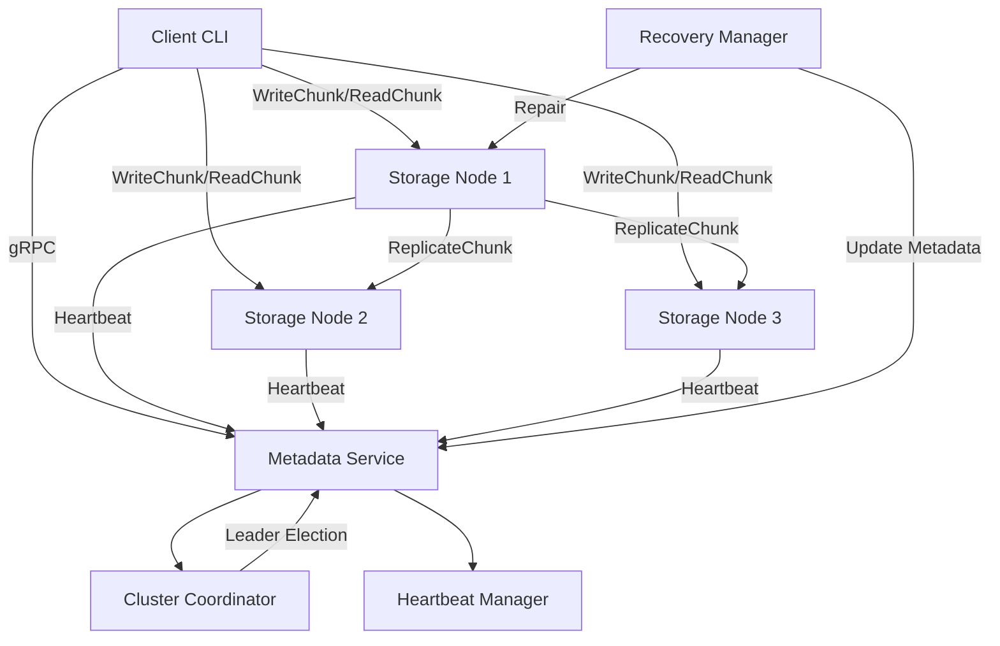
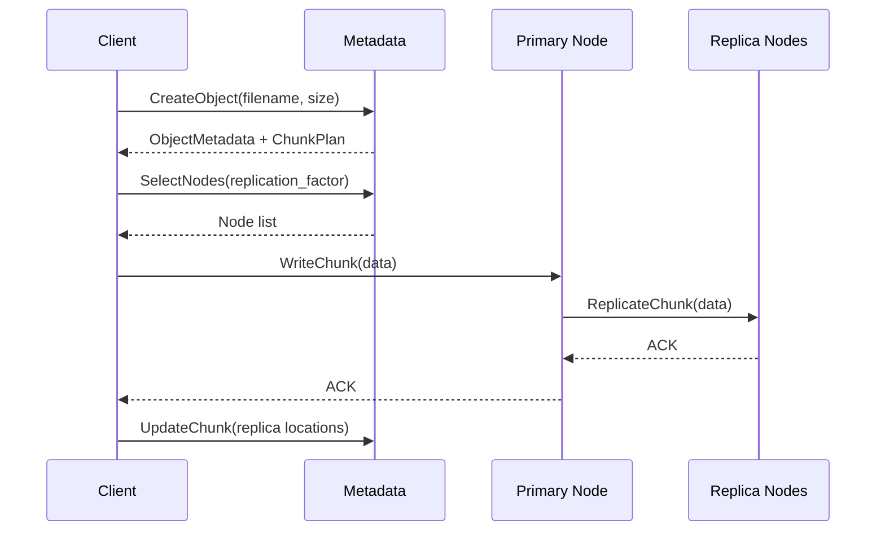
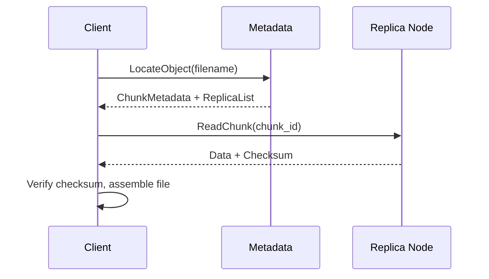
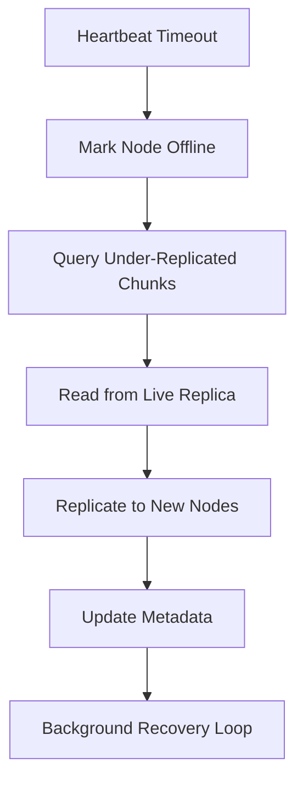

# Distributed Storage Engine (DSE)

A production-style distributed object storage engine built in C++20, inspired by HDFS, Ceph, MinIO, and Amazon S3. Supports multi-node replication, metadata management, leader election, fault detection, and automatic recovery.

## Overview

DSE is a chunked, replicated object store designed for learning and demonstration of distributed systems concepts:

- **Multiple storage nodes** with independent chunk storage
- **Metadata service** tracking objects, chunks, and replica locations
- **Configurable replication** (default factor 3, primary-backup strategy)
- **Bully algorithm leader election** for cluster coordination
- **Heartbeat-based failure detection** with automatic recovery
- **gRPC networking** with Protocol Buffers
- **CLI client** for put/get/delete/list/head operations
- **Docker Compose** for local cluster deployment

## Architecture



### Components

| Component | Description |
|-----------|-------------|
| **Client** | CLI and library for PUT/GET/DELETE/LIST/HEAD |
| **Metadata Service** | Object/chunk mapping, node registry, cluster state |
| **Storage Nodes** | Local chunk persistence with checksum verification |
| **Cluster Coordinator** | Bully algorithm leader election |
| **Heartbeat Manager** | Periodic health reporting and failure detection |
| **Recovery Manager** | Under-replicated chunk repair |
| **Replication Manager** | Primary-backup chunk replication |

## Storage Flow

### Write (PUT)



### Read (GET)



## Chunk Format

Each chunk is stored on disk with a binary header:

```
[Magic: 4B "DSEK"] [Version: 4B] [ChunkIdLen: 4B] [ChunkId: var]
[ObjectIdLen: 4B] [ObjectId: var] [PayloadSize: 8B]
[ChecksumLen: 4B] [SHA-256 Checksum: var] [CreatedAt: 8B] [Payload: var]
```

- Chunk IDs are UUIDs
- Checksum: SHA-256 of payload
- Atomic writes via temp file + rename
- Configurable chunk sizes: 1/4/8/16 MB

## Leader Election

Uses the **Bully algorithm**:

1. On startup, each coordinator peer checks for a leader
2. If no leader, node with highest priority starts election
3. Election messages sent to higher-priority peers
4. If no response from higher peers, node becomes leader
5. Leader announces via `AnnounceLeader` RPC
6. Leader manages recovery triggers and metadata generation numbers

## Recovery Workflow



## Project Structure

```
Distributed_storage_engine/
├── CMakeLists.txt
├── README.md
├── proto/                    # Protocol Buffer definitions
│   ├── storage.proto
│   ├── metadata.proto
│   └── coordinator.proto
├── include/                  # Public headers
│   ├── common/               # Types, config, checksum, threading
│   ├── chunk/                # Chunk format and store
│   ├── metadata/             # Metadata store and service
│   ├── storage/              # Storage node service
│   ├── replication/          # Replication manager
│   ├── coordinator/          # Leader election
│   ├── heartbeat/            # Heartbeat manager
│   ├── recovery/             # Fault recovery
│   ├── client/               # Client library
│   └── network/              # gRPC utilities
├── src/                      # Implementations
├── tests/                    # GoogleTest suite
├── scripts/                  # Cluster startup and benchmarks
├── docker/                   # Docker Compose deployment
├── docs/                     # Architecture documentation
└── .github/workflows/        # CI pipeline
```

## Build Instructions

### Prerequisites

- C++20 compiler (GCC 11+, Clang 14+, MSVC 19.30+)
- CMake 3.20+
- gRPC and Protocol Buffers
- spdlog
- GoogleTest (for tests)

**Ubuntu/Debian:**

```bash
sudo apt-get install -y build-essential cmake pkg-config \
    libgrpc++-dev libprotobuf-dev protobuf-compiler-grpc \
    libspdlog-dev libgtest-dev
```

### Build

```bash
cmake -B build -DCMAKE_BUILD_TYPE=Release -DDSE_BUILD_TESTS=ON
cmake --build build -j$(nproc)
```

### Binaries

| Binary | Purpose |
|--------|---------|
| `dse-metadata-service` | Metadata + coordinator service |
| `dse-storage-node` | Storage node daemon |
| `storage` | CLI client |

## Running a Local Cluster

### Option 1: Python script

```bash
python scripts/start_cluster.py
```

### Option 2: Manual

```bash
# Terminal 1: Metadata
./build/dse-metadata-service --address 0.0.0.0:50051

# Terminal 2-4: Storage nodes
./build/dse-storage-node --node-id=storage1 --address=0.0.0.0:50053 --storage-path=./data/storage1
./build/dse-storage-node --node-id=storage2 --address=0.0.0.0:50054 --storage-path=./data/storage2
./build/dse-storage-node --node-id=storage3 --address=0.0.0.0:50055 --storage-path=./data/storage3
```

### Option 3: Docker Compose

```bash
cd docker
docker compose up --build
```

## CLI Usage

```bash
# Upload
storage --metadata localhost:50051 put sample.bin

# Download
storage --metadata localhost:50051 get sample.bin output.bin

# Delete
storage --metadata localhost:50051 delete sample.bin

# List objects
storage --metadata localhost:50051 list

# Object metadata
storage --metadata localhost:50051 head sample.bin
```

## Configuration

Key settings in `docker/configs/*.cfg`:

| Setting | Default | Description |
|---------|---------|-------------|
| `replication_factor` | 3 | Number of replicas per chunk |
| `chunk_size_mb` | 4 | Chunk size (1, 4, 8, or 16 MB) |
| `heartbeat_interval_sec` | 5 | Heartbeat frequency |
| `heartbeat_timeout_sec` | 15 | Failure detection threshold |
| `load_balance` | least_used | Node selection: round_robin, least_used, random |
| `write_ack` | majority | Replication ACK: majority or all |

Environment variables: `DSE_NODE_ID`, `DSE_STORAGE_PATH`, `DSE_METADATA_ADDRESS`, `DSE_REPLICATION_FACTOR`.

## Benchmarks

```bash
python scripts/benchmark.py --metadata localhost:50051 --dataset 100mb --iterations 5
python scripts/benchmark.py --dataset all --concurrent 8
```

Measures: upload/download throughput, latency (avg, p95), concurrent client performance.

## Testing

```bash
cd build && ctest --output-on-failure
```

Test coverage:
- Checksum and UUID generation
- Chunk format serialization/deserialization
- Chunk store read/write/delete/verify
- Metadata store CRUD, node registration, load balancing
- Thread pool concurrency
- Configuration loading

## Resume Bullet Mapping

| Resume Bullet | Implementation |
|---------------|----------------|
| Built distributed storage prototype supporting replication, metadata management, and fault recovery | Full object store with chunked replication, metadata service, recovery manager |
| Implemented distributed coordination and scalable storage access mechanisms | Bully leader election, heartbeat failure detection, gRPC-based parallel client access, load-balanced node selection |

## Future Improvements

- [ ] RocksDB metadata persistence (CMake flag `DSE_USE_ROCKSDB`)
- [ ] Raft consensus for metadata HA
- [ ] Chain replication strategy
- [ ] Rack-aware placement
- [ ] Write-ahead log for storage nodes
- [ ] Connection pooling and zero-copy reads
- [ ] S3-compatible REST API gateway
- [ ] Prometheus metrics export
- [ ] Erasure coding for storage efficiency

## License

MIT
